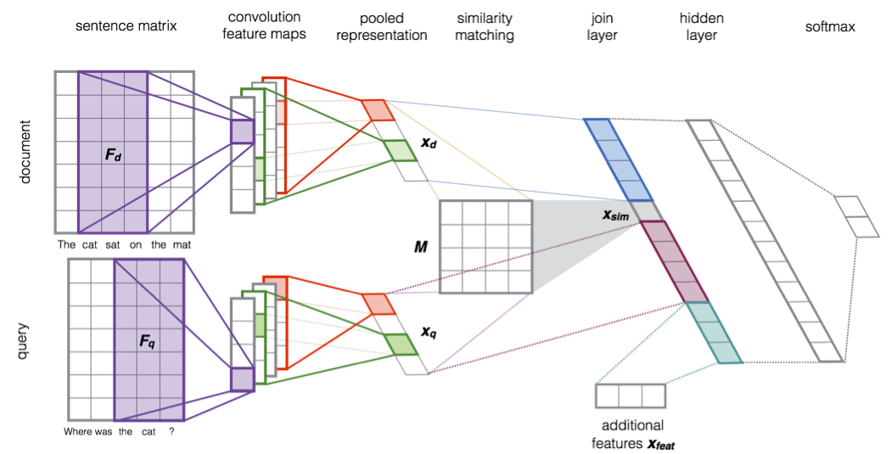

# Deep learning implementation of question/answer for information retrieval.

This is a deep learning implementation of question/answer for information
retrieval the Severyn et al. [paper] "Learning to Rank Short Text Pairs with
Convolutional Deep Neural Networks".

*Important*: for those interested in building on this source, please see the
[derived works](#derived-works) section.

<!-- markdown-toc start - Don't edit this section. Run M-x markdown-toc-refresh-toc -->
## Table of Contents

- [Problem Definition](#problem-definition)
    - [Example Input and Output](#example-input-and-output)
- [Corpus](#corpus)
    - [Corpus Statistics](#corpus-statistics)
- [Evaluation](#evaluation)
- [Model](#model)
    - [Features](#features)
    - [Configuration](#configuration)
- [Changes](#changes)
- [Latent Semantic Analysis Baseline](#latent-semantic-analysis-baseline)
- [Installing](#installing)
- [Usage](#usage)
    - [Quick Start](#quick-start)
    - [Iterative Method for Results](#iterative-method-for-results)
- [Results](#results)
    - [Baseline](#baseline)
    - [Neural Net Method](#neural-net-method)
- [Changelog](#changelog)
- [License](#license)

<!-- markdown-toc end -->

## Problem Definition

This implementation ranks a paragraph for a given user question.  Many
question/answer (QA) systems use a multi-level classifier to narrow down to an
answer as classified by a text span in the original document.  The model given
in this implementation provides that first *course* level classification.  A
subsequent component of a pipeline would then later classify the text span
providing the answer to the user.  An example of this later pipeline component
is to use the [BERT] model.


### Example Input and Output

Example from the trained model:

**Question**:

> How many ministries of the Scottish government does a committee typically
> correspond to?

**Paragraph classified with rank 0 and probability 97.7%** (correct paragraph):

> Subject Committees are established at the beginning of each parliamentary
> session, and again the members on each committee reflect the balance of
> parties across Parliament. Typically each committee corresponds with one (or
> more) of the departments (or ministries) of the Scottish Government. The
> current Subject Committees in the fourth Session are: Economy, Energy and
> Tourism; Education and Culture; Health and Sport; Justice; Local Government
> and Regeneration; Rural Affairs, Climate Change and Environment; Welfare
> Reform; and Infrastructure and Capital Investment.

**Paragraph classified with rank 1 and probability 96.1%** (incorrect paragraph):

> The debating chamber of the Scottish Parliament has seating arranged in a
> hemicycle, which reflects the desire to encourage consensus amongst elected
> members. There are 131 seats in the debating chamber. Of the total 131 seats,
> 129 are occupied by the Parliament's elected MSPs and 2 are seats for the
> Scottish Law Officers – the Lord Advocate and the Solicitor General for
> Scotland, who are not elected members of the Parliament but are members of
> the Scottish Government. As such the Law Officers may attend and speak in the
> plenary meetings of the Parliament but, as they are not elected MSPs, cannot
> vote. Members are able to sit anywhere in the debating chamber, but typically
> sit in their party groupings. The First Minister, Scottish cabinet ministers
> and Law officers sit in the front row, in the middle section of the
> chamber. The largest party in the Parliament sits in the middle of the
> semicircle, with opposing parties on either side. The Presiding Officer,
> parliamentary clerks and officials sit opposite members at the front of the
> debating chamber.

For this example, the correct paragraph is ranked first.  Had the two
paragraphs been switched it would have a rank of 1.  Read
[here](https://en.wikipedia.org/wiki/Ranking_(information_retrieval)) for more
information on ranking.


## Corpus

This uses the 1.1 version of the [SQuAD] corpus.  Note that the paper uses a
different corpus, which explains the different (but not dissimilar) results.
The corpus was created from Wikipedia articles and annotated with questions on
a per paragraph basis with text spans including the answer.

Given this project attempts only to classify a paragraph for a query, the
answer annotations are not used.  While not explicitly explained in the
[paper], it is assumed for this implementation that the problem is framed as a
binary classification.  For this reason, this model also uses a binary
classification on a question belonging to a paragraph.  More specifically, the
model says *yes* when it thinks a particular paragraph **P** answers a question
**Q** for all question/answer pairs in the data set.

The data set is generated with a somewhat even number of positive to negative
examples.  The positive examples are created by pairing all questions with
their respective paragraph from the corpus.  Negative examples are created by
pairing paragraphs with questions from other paragraphs at random without
replacement.  More specifically a paragraph **P_i** that that contains the
answer for question **Q_j** for all **i** and **j** where **i != j**.  These
examples create triples in the form:

```python
(paragraph, question, <True | False>)
```


### Corpus Statistics

The [SQuAD] v1.1 corpus has the following paragraphs and questions:

| Data Set   | Articles | Paragraphs | Questions |
|------------|----------|------------|-----------|
| Train      | 442      | 18,896     | 87,599    |
| Test (dev) | 42       | 2,067      | 10,570    |
| Totals     | 484      | 20,963     | 98,169    |


The synthesized corpus used for this implementation has the following
composition:

| Data Set   | Positive | Negative |
|------------|----------|----------|
| Train      | 87,599   | 75,584   |
| Test (dev) | 10,570   | 10,335   |
| Totals     | 163,183  | 20,905   |

The positive and negative aren't evenly stratified because the number of
negative questions are estimated a priori in terms of paragraphs.  A future
work is to make these numbers more even using an iterative method.


## Evaluation

The data set described in the [corpus](#corpus) used to train the network using
20% of the training set as a validation.  The `dev` data set was used as a hold
out testing set on the trained model, again with a near even positive and
negative strata.


## Model

The model implements something very similar to the [papar] with a few
[exceptions](#changes).  It uses the deep learning neural network
architecture pictured below.




### Features

The set of features were taken from [word2vec] word vectors and the output of
[SpaCy].  The word vectors were used as the input layer and used zero vectors
for out of vocabulary words.  Each token of the paragraph and question add the
dimension (300) of the word vector with 0 padding for out of vocabulary words.
The width of the input layer is the sum of the maximum number of tokens all
paragraphs and questions.  Zero padding is also used for utterances with token
counts less than the max.

The maximum token count for paragraphs is 566 and questions were 34.  These
counts were taken across both training and development data sets.


### Configuration

All parsing, training and testing parameters and configuration are stored in
the [configuration file].  The documentation for each parameter is given as
comments in that file.


## Changes

This implementation follows the [paper] pretty closely.  However it differs in
the following ways:

* This work used the [SQuAD] corpus instead of the [TREC QA] data set from Wang
  et al.
* It uses 70 instead of 100 convolution filters for each question and paragraph
  each.  Adding additional filters past 20 did not change the performance with
  any statistical significance.  This is configurable in the `nn_model` section
  of the [configuration file].
* Additional [SpaCy] features in the input layer were used, which included:
  * POS tag
  * Named entity from the SpaCy named entity recognizer (NER).
  This is configurable in the `corpus_token_normalizer` in the [configuration
  file].
* Number of shared named entity as a count is used in the "common" shared
  layer.
* The Google pre-trained [word2vec] word vectors were used, where as Severyn et
  al. trained their own.


## Latent Semantic Analysis Baseline

A baseline was also computed using [Latent Semantic Analysis] (LSA) and
K-Nearest Neighbor as a non-supervised learning task.  LSA is an older method
and fundamentally different, but it helps to put the results in perspective.

The training set paragraphs were used to train the model, which for LSA meaning
to use Singular Value Decomposition (SVD) and then reduce dimensionality for
the low rank approximation.  The dimensionality used was 200 (see the
[configuration file]).

Across the 18,896 paragraphs used to train the model, 87,599 questions were
ranked.  Again, given the nature of unsupervised training, the paragraphs only
from the training set are used for training to keep at the same level of
training data for neural model.


## Installing

You need to install the following first:

* Python [3.6](https://www.python.org/downloads/release/python-369/)
* CUDA [9](https://developer.nvidia.com/cuda-92-download-archive)
* [GNU Make](https://www.gnu.org/software/make/)

GNU make is not a must, but everything is automated with make so adding it will
make your life easier.  If you decide not to, follow the flow of the
[makefile] as duplicate instructions aren't given.


## Usage

The project was written to repeat steps for consistent results and easily test
hyper parameter tuning and natural language parsing configurations.


### Quick Start

For the brave, you can do all steps with `make all`.  Chances are given the
fickle nature of Python environments something will fail--but you might get
lucky.


### Iterative Method for Results

Otherwise, do the following and plan to make coffee:

1. Install Python `virtualenv`: `pip3 install virtualenv`.
2. Start with a clean slate (if rebuilding): `make vaporize`.
3. Create a Python 3.6 virtual environment: `make virtualenv`.  Note a virtual
   environment isn't necessary, but it is recommended.  Otherwise comment out
   the `PYTHON_BIN` line in the [makefile] to use the system default.
4. Download and parse the corpus: `make parse`.  This downloads the [SQuAD]
   corpus the first time (if not found) to `data/corpora/squad`.  Once the
   corpus is downloaded it is parsed with [SpaCy] and stored as binary Python
   pickled files in `data/proc`.
4. Extract and store features from the [SpaCy] parse: `make features`.  This
   creates features from the parsed data in a fast consumable format for the
   training phase.
5. Train the model: `make train`.  This trains the neural network and quits
   using early stopping when the validation loss increases.
6. Test the model: `make test`.  This tests the network by computing an
   accuracy on rank 0 across the test set, which is the [SQuAD] `dev` data set.
7. Compute the rankings: `make calcrank`.  This stores the rank of each
   question across all paragraphs of the data set, which takes a *very* long
   time.  Each ranking with all predictions with question/paragraph IDs are
   stored on disk.
7. Compute the [mean reciprocal rank] of the [SQuAD] `dev` data set: `make
   calcmrr`.  This uses the ranking results from the previous step to compute
   the MRR score.
8. Compute the same metrics for the baseline: `make lsammr`.

Note that each step creates it's respective log file, which is dumped to the
`log` directory.


## Results

All results were tested on the same set of features created by [SpaCy] as
mentioned in the [features](#features) section.


### Baseline

As described in the [LSA Baseline](#lsa-baseline) section, the training and
evaluation were over ~87.5K questions trained from 18.9K paragraphs.  The mean
reciprocal rank was 0.1902, meaning the the correct paragraph was ranked as the
5.2567 most probable average.  The rank standard deviation was 0.3258.


### Neural Net Method

As described in the [evaluation](#evaluation) section, the trained model was
used to rank 10,570 question across 2,067 paragraphs.  A mean reciprocal rank
of 0.7088 was achieved with a standard deviation or 0.392.  Again, taking the
reciprocal one can think of the correct paragraph as ranked as the 1.411 most
probable classification.  It ranks the correct paragraph with rank 0 for the
given test data set question/answer pairing with an overall accuracy of 96%.

The [paper] trained and tested on the [TREC QA] data set achieves an improved
score of 0.8078.  The data set and [other differences](#changes) might explain
why these results differ.  My guess is that it has a lot to do with the corpus
over which the word vectors were trained.  Further error analysis and testing
on the TREC data set might provide answer to this question.  However, this work
was an exercise and not an academic paper.

Perhaps someone else can run this project on the TREC corpus.  If you do,
submit a pull request and I'll fold in your code and give you credit for your
work.


## TREC QA Data Set

The [paper] cites the corpus they used in their experiments from the [Wang et
al. "What is the jeopardy model? a quasi-synchronous grammar for
qa"](https://www.aclweb.org/anthology/D07-1003) paper.

The data set can be downloaded
[here](http://cs.stanford.edu/people/mengqiu/data/qg-emnlp07-data.tgz).


## Derived Works

If you build on this work, by this license you *must* provide me and the
original authors in the [paper] attribution.  Doing otherwise goes against the
[MIT Open Source License](LICENSE), academic norms, and is morally wrong.


## Changelog

An extensive changelog is available [here](CHANGELOG.md).


## License

Copyright (c) 2019 Paul Landes

Permission is hereby granted, free of charge, to any person obtaining a copy of
this software and associated documentation files (the "Software"), to deal in
the Software without restriction, including without limitation the rights to
use, copy, modify, merge, publish, distribute, sublicense, and/or sell copies
of the Software, and to permit persons to whom the Software is furnished to do
so, subject to the following conditions:

The above copyright notice and this permission notice shall be included in all
copies or substantial portions of the Software.

THE SOFTWARE IS PROVIDED "AS IS", WITHOUT WARRANTY OF ANY KIND, EXPRESS OR
IMPLIED, INCLUDING BUT NOT LIMITED TO THE WARRANTIES OF MERCHANTABILITY,
FITNESS FOR A PARTICULAR PURPOSE AND NONINFRINGEMENT. IN NO EVENT SHALL THE
AUTHORS OR COPYRIGHT HOLDERS BE LIABLE FOR ANY CLAIM, DAMAGES OR OTHER
LIABILITY, WHETHER IN AN ACTION OF CONTRACT, TORT OR OTHERWISE, ARISING FROM,
OUT OF OR IN CONNECTION WITH THE SOFTWARE OR THE USE OR OTHER DEALINGS IN THE
SOFTWARE.


<!-- links -->
[paper]: http://eecs.csuohio.edu/~sschung/CIS660/RankShortTextCNNACM2015.pdf
[makefile]: makefile
[SpaCy]: https://spacy.io
[SQuAD]: https://rajpurkar.github.io/SQuAD-explorer/
[mean reciprocal rank]: https://en.wikipedia.org/wiki/Mean_reciprocal_rank
[configuration file]: resources/dlqa.conf
[word2vec]: https://code.google.com/archive/p/word2vec/
[BERT]: https://github.com/google-research/bert
[Latent Semantic Analysis]: https://en.wikipedia.org/wiki/Latent_semantic_analysis
[TREC QA]: #trec-qa-data-set
